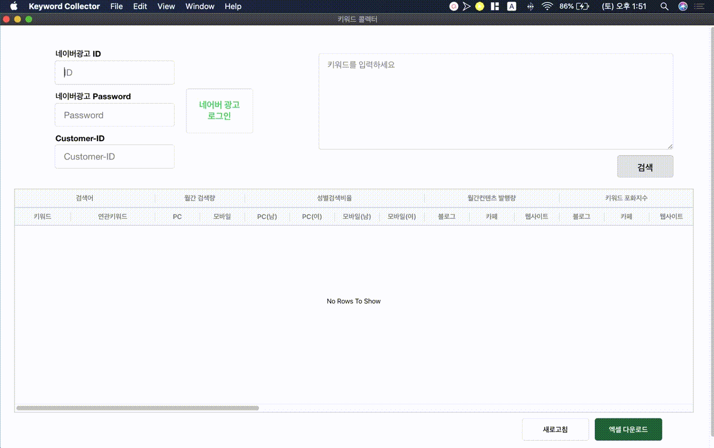

# Keyword Collector

## Table of Contents

- [Keyword_Collector](#keyword-collector)
  - [Table of Contents](#table-of-contents)
  - [About The Project](#about-the-project)
    - [Built With](#built-with)
  - [Getting Started](#getting-started)
    - [Prerequisites](#prerequisites)
    - [Installation](#installation)
  - [Usage](#usage)
  - [Contact](#contact)

 
 

## About The Project

 

**제공 데이터**

- 연관키워드, 키워드별 월간 검색량, 성별 검색비율, 컨텐츠 발행량, 키워드 포화지수, 연령별 검색비율, 월별 검색동향, 섹션배치순서(PC), 섹션배치순서(모바일)의 데이터를 제공합니다.
- 네이버 검색 API와, 네이버 광고 관리자 크롤링를 활용하여 데이터를 수집하였습니다.

**기술 스택**

- 데이터 grid 표현을 위해 ag-grid를 활용하였습니다.
- Frontend는 ReactJS, Backend에는 NodeJS를 사용하였습니다.
- Electron기반의 데스크탑 어플리케이션입니다.
- 엑셀 Export 기능을 제공합니다.

 
 

### Built With

- [React JS](https://ko.reactjs.org/)
- [Node JS](https://nodejs.org/ko/)
- [Express](https://expressjs.com/ko/)
- [AG Grid](https://www.ag-grid.com/)
- [Puppeteer](https://github.com/puppeteer/puppeteer)
- [네이버 검색 API](https://naver.github.io/searchad-apidoc/#/guides)
- [네이버 광고 관리자](https://searchad.naver.com/)

 
 

## Getting Started

### Prerequisites

노드 패키지 매니저 설치

<pre>
<code>
npm install npm@latest -g
</code>
</pre>

### Installation

1. Repo 클론
<pre>
<code>
git clone https://github.com/Kylekoh/football-stat.git
</code>
</pre>

2. NPM 패키지 설치
<pre>
<code>
npm install
yarn add
</code>
</pre>

3. 프로젝트 시작
<pre>
<code>
npm start
yarn start
</code>
</pre>

 
 

## Usage

- 네이버 광고 로그인
  
   

- 키워드 검색
  
   

- 검색 결과 엑셀 Export
  

## Contact

<ykoh728@gmail.com>
